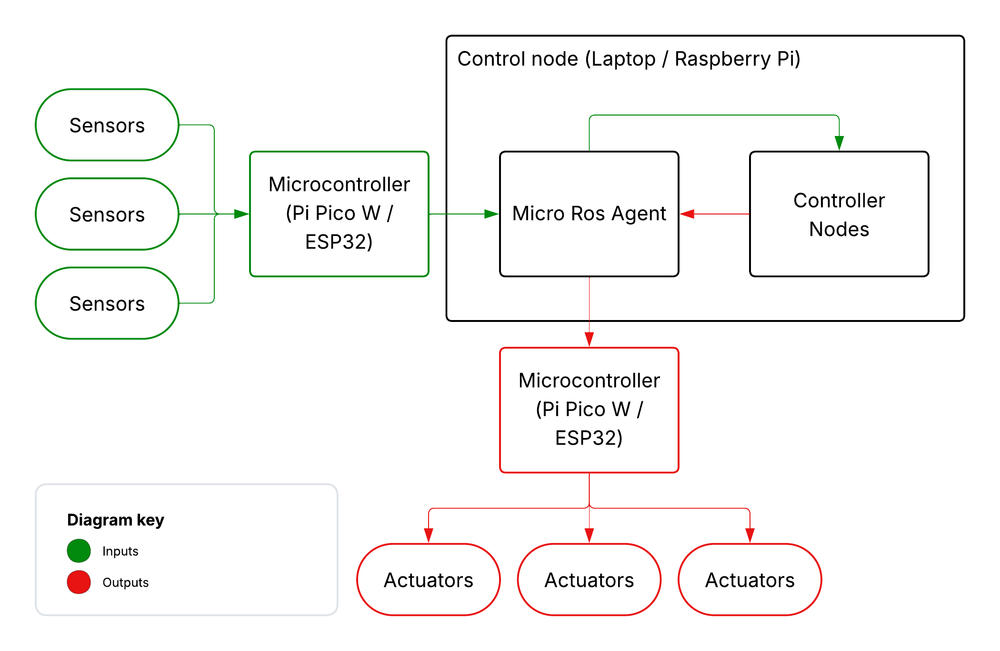

# 00. The architecture

Before we start diving into the code, we need to have an understanding of how this all fits together.

## The platform

To make this as easy as possible to manage, and as portable as possible, I'm going to be using Docker Compose to manage my ROS2 installation.

Documentation on how to use ROS2 in Docker is incredibly thin on the ground, with the "official" examples literally showing how to run two nodes and very little else, so hopefully I'll be able to explain that in a bit more detail further down the page.

I'll be using [MicroROS](https://micro.ros.org/) for the code that runs on the microprocessors. This framework is reasonably well documented for the basics, but for doing things like we're going to be doing using message formats for GPS etc, it's also not very comprehensive.

The flow of data is going to be as follows:


/// caption
The data is collected by the sensors and passed to a microcontroller, which then forwards the data via Micro ROS Agent to the control nodes. The control nodes process the data, make decisions, and then send commands back through Micro ROS to the actuator microcontrollers, and it is these that then send the commands to turn the wheels, adjust the speed etc
///

We'll also be using [Foxglove](https://app.foxglove.dev/) as our primary environment for viewing and sending data, as it has a much lower barrier to entry (and a nicer user interface!) than the built-in tools of ROS2 such as RViz.

## Docker and Docker Compose

Docker has rapidly become the standard for building container-based workloads across the IT Industry, with more advanced deployment methods such as Kubernetes leaning heavily on the Docker container format.

In this project Kubernetes is too complicated for our needs, however Docker Compose gives us a really simple environment that we can use to launch multiple containers (we'll need them!) and keep the control side of things as modular as the hardware side.

Throughout this project, we're going to rely on the following `docker-compose.yaml` file to receive and explore our data:

```yaml
services:
  # This links us to Foxglove Studio so we can visualise and work with the data
  # without needing to install a load of ROS2 services until we need them
  foxglove_bridge:
    image: ros:kilted-ros-base
    network_mode: host
    volumes:
      - ./ws:/ws
    environment:
      - RMW_IMPLMENTATION=rmw_fastrtps_cpp
      - ROS_DOMAIN_ID=0
    command: >
      bash -lc '
      apt update && apt install -y ros-$ROS_DISTRO-foxglove-bridge && ros2 launch foxglove_bridge foxglove_bridge_launch.xml port:=8765 address:="0.0.0.0"
      '

  # Start our agent so our nodes can connect and communicate with the rest
  # of the ROS2 setup as we build it.
  ros_micro_agent:
    image: microros/micro-ros-agent:kilted
    network_mode: host
    volumes:
      - ./ws:/ws
    environment:
      - RMW_IMPLMENTATION=rmw_fastrtps_cpp
      - ROS_DOMAIN_ID=0
    command: ["udp4","--port","8888","-v6"]
```

If you add the above file to your project and then run `docker compose up`, you should see devices connect and data arrive in Foxglove as we add the sensors and actuators.
